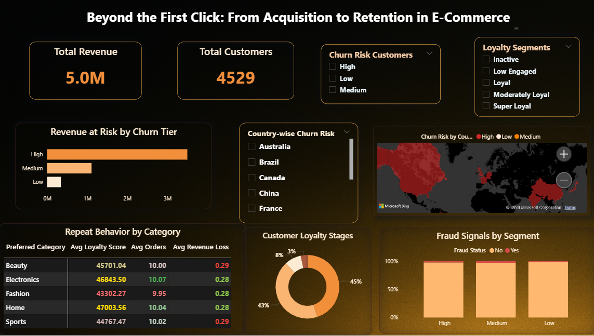

# Beyond the First Click: Customer Funnel & Retention Analysis (Power BI + SQL) 

## TL;DR
**Problem:** E-commerce growth depends on converting first-time buyers into repeat customers, but drop-offs across the customer funnel were unclear, and revenue risk was hidden.

**Process:** Used **SQL, Excel, and Power BI** to map the customer funnel from first purchase to repeat behavior, segment users by loyalty and churn risk, and overlay fraud signals to identify revenue leakage.

**Result:** 
- Identified that **8% of customers generated 45% of revenue**, but sat in **high-risk funnel stages**
- Highlighted **$3.49M** in revenue at risk due to churn-prone funnel segments
- Flagged category-level differences in funnel conversion and retention strength

**Takeaway:** Funnel-based retention analysis reveals where customers drop off, which segments drive revenue, and where targeted retention strategies can deliver the highest ROI.

## Dashboard Preview
Power BI dashboard with:
- Customer segmentation
- Repeat-purchase patterns
- Fraud overlaps
- Revenue-at-risk

Designed as a quick-scan interface for stakeholder decision-making.



## Table of Contents
 * [Overview](#overview)
 * [Tools Used](#tools-used)
 * [Dataset Snapshot](#dataset-snapshot)
 * [Key Funnel Insights & Business Impact](#key-funnel-insights--business-impact)
 * [Case Study: Full Walkthrough](#case-study-full-walkthrough)
 * [What I'd Explore Next](#what-id-explore-next)
 * [What This Project Demonstrates](#what-this-project-demonstrates)
 * [Let's Connect](#lets-connect)

## Overview
This project analyzes the **e-commerce customer funnel**, focusing on how users move from first purchase to repeat behavior and where revenue leakage occurs. Using SQL-based segmentation and a Power BI dashboard, I examined retention patterns, churn risk, fraud overlap, and category-level funnel performance to support business and marketing decision-making.

## Tools Used
- **MySQL:** Data modeling, cohort segmentation, churn & fraud logic
- **Microsoft Excel:** Data cleaning and validation
- **Power BI:** Dashboard design, interactivity, and storytelling

## Dataset Snapshot
```markdown
|Metric                  |Value       |
|------------------------|------------|
|Total Customers         | 4529       |
|Average Age             | 48.1 Years |
|Number of Countries     | 10         |
|Average Order Value     | 108.54     |
|Average Orders/Customer | 10.02      |
```

## Key Funnel Insights & Business Impact
**Funnel Concentration**
* A small **high-value funnel segment (8%)** contributes nearly half of total revenue.
* These users sit deeper in the funnel but still show elevated churn risk → retention priority. 

**Funnel Leakage (Revenue at Risk)**
* **43% of revenue** comes from customers showing churn signals.
* Indicates drop-offs after initial conversion, not acquisition issues.

**Risk Overlay (Fraud + Churn)**
* Fraud flags cluster around late-stage funnel users with declining engagement.
* Suggests disengagement and risk rise together, impacting profitability.

**Category Funnel Performance**
* Home & Sports show strong repeat conversion.
* Fashion shows high entry but weaker funnel progression → acquisition-heavy, retention-light.

## Case Study: Full Walkthrough
See the detailed business context, SQL logic, and dashboard decisions behind this project:

[View the full case study here](https://docs.google.com/document/d/1QslwGDxt7Uj1MzdJjwGdME_j7KGeKJMZOj6Lu6rDnZg/edit?usp=sharing)

## What I'd Explore Next
- **LTV Prediction Modeling:** Estimate customer lifetime value using purchase patterns
- **Retention Simulation:** Test loyalty-program changes and model uplift scenarios
- **Win-back analysis:** Identify traits of customers who return after churning

## What This Project Demonstrates
- Ability to build end-to-end customer analytics workflows (from SQL logic to Power BI dashboards)
- Exposure to segmentation, churn scoring, and fraud overlay techniques
- Understanding of how user behavior links to revenue risk and retention strategy
- Practice turning complex data into stakeholder-facing insights
- Ability to frame customer behavior through a funnel and retention lens, not just descriptive churn metrics

## Let's Connect
I'm building my career in data analytics and love uncovering business insights through customer behavior and segmentation. Feel free to reach out via:

* [GitHub](https://github.com/Shrey0561)
* [LinkedIn](https://www.linkedin.com/in/shreya-srinath-879a66205/)
* [Notion](https://www.notion.so/Data-Analyst-Portfolio-221ebe151fdd801e9445e32590b67758?source=copy_link)

I'm always open to conversations, mentorship, or entry-level opportunities.
